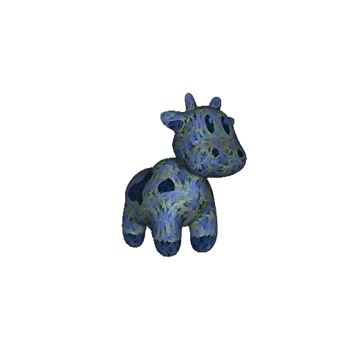

# CLIP-based Neural Neighbor Style Transfer for 3D Assets

This repository contains the code for our [paper](https://arxiv.org/abs/2208.04370), CLIP-based Neural Neighbor Style Transfer for 3D Assets.

## Dependencies
Before you install make sure you have CUDA capable devices. Without such devices, the code will not run. 

Start with installing the dependencies:
``` sh
pip install -q ftfy regex tqdm
pip install -q git+https://github.com/openai/CLIP.git
pip install -q ninja imageio PyOpenGL glfw xatlas gdown
pip install -q git+https://github.com/NVlabs/nvdiffrast/
pip install -q kmeans-pytorch
pip install -q --global-option="--no-networks" git+https://github.com/NVlabs/tiny-cuda-nn/#subdirectory=bindings/torch
```

## How to run 

After you have everything installed, running is pretty simple and straight forward. 

``` sh
python optimize.py \
    --style-image ./assets/starry.jpg \
    --input-mesh ./assets/spot.obj \
    --output-path /tmp \
    --batch-size 4 \
    --iteration 15000 \
    --texture-res 1024 \
    --render-res 512 \
    --scale 1.5 
```

In order to run in multi-GPU setting, please setup slurm or proper environment variables.

After complete optimization, you will get the stylized image.



# Licenses
All the files inside the `./rasterizer` folder is under NVIDIA's license. The original source code for files under `./rasterzier` can be found in [ this link ]( https://github.com/NVlabs/nvdiffmodeling ). I copied these files from `nvdiffmodeling` to accommodate changes according to [ updated version ]( https://github.com/NVlabs/nvdiffrec ) from `nvdiffrec`.

However, everything else is MIT license. Since the code requires the using `nvdiffrast`, it might be useful to get proper license for commercial purpose. 

Asides from that feel free to use this on your personal projects and research. The [ NVIDIA open source license ]( https://github.com/NVlabs/nvdiffmodeling/blob/main/LICENSE.txt ) allows all non commercial work.

**Assests**
- [Spot](https://www.cs.cmu.edu/~kmcrane/Projects/ModelRepository/index.html#spot) is in public domain. Thanks to [Keenan Crane](https://www.cs.cmu.edu/~kmcrane/index.html).
- [Starry night](https://upload.wikimedia.org/wikipedia/commons/thumb/e/ea/Van_Gogh_-_Starry_Night_-_Google_Art_Project.jpg/1920px-Van_Gogh_-_Starry_Night_-_Google_Art_Project.jpg) is from Wikipedia.
